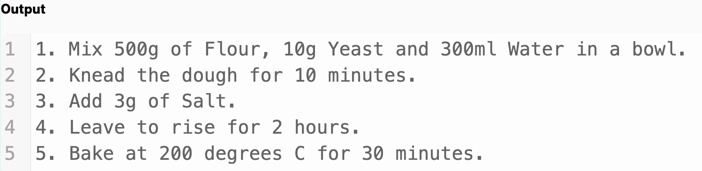
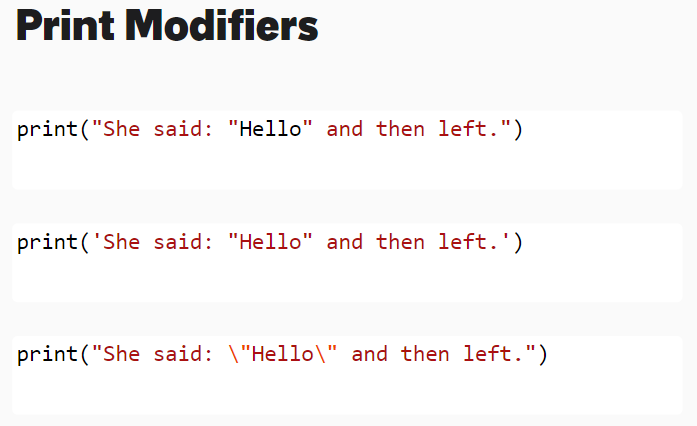
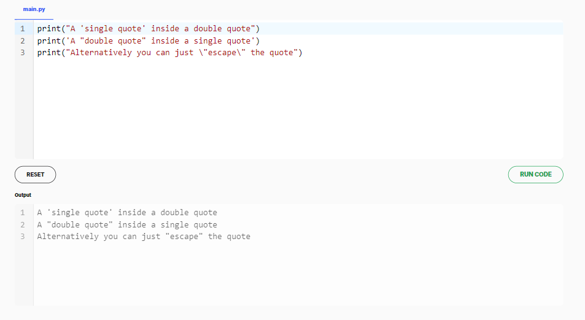
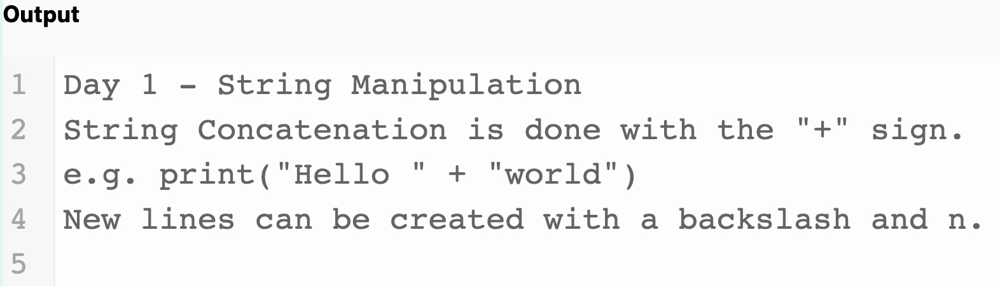

# Day 1

## LESSON 1 - PRINTING

### Instructions
Write a program that uses print statements to print the following recipe into the Output console. The text to print is already there, you just need to make it into code. Your code should print all five lines exactly the same as the example output below.

### Example Output




### Hint

The output in your program should match the example output shown above exactly, character for character, even spaces and symbols should be identical, otherwise the tests won't pass!

### Solution

```python
print("1. Mix 500g of Flour, 10g Yeast and 300ml Water in a bowl.")
print("2. Knead the dough for 10 minutes.")
print("3. Add 3g of Salt.")
print("4. Leave to rise for 2 hours.")
print("5. Bake at 200 degrees C for 30 minutes.")
```


### Print Modifiers






## LESSON 2 - DEBUGGING PRACTICE


### Instructions

Look at the code in the code editor on the left. There are errors on all 4 lines of code. Fix the code so that it runs without errors.

### Given Code

```python
# Fix the code below 👇
print(Day 1 - String Manipulation")
print("String Concatenation is done with the "+" sign.")
  print('e.g. print("Hello " + "world")')
print(("New lines can be created with a backslash and n.")
```

### Example Output




### Hint

The output in your program should match the example output shown above exactly, character for character, even spaces and symbols should be identical, otherwise the tests won't pass!

### Solution

```python
print("Day 1 - String Manipulation")
print('String Concatenation is done with the "+" sign.')
print('e.g. print("Hello " + "world")')
print("New lines can be created with a backslash and n.")
```

**Part 1**
```python
# Answer part 1. Missing double quotes before the word Day.
# print(Day 1 - String Manipulation")
print("Day 1 - String Manipulation")
```


**Part 2**
```python
# Answer part 2. Outer double quotes changed to single quotes.
# print("String Concatenation is done with the "+" sign.")
print('String Concatenation is done with the "+" sign.')
```

**Part 3**
```python
# Answer part 3. Extra indentation removed
#   print('e.g. print("Hello " + "world")')
print('e.g. print("Hello " + "world")')
```

**Part 4**
```python
# Fix the code below 👇
# Answer part 4. Extra ( in print function removed.
# print(("New lines can be created with a backslash and n.")
print("New lines can be created with a backslash and n.")
```


## LESSON 3 - INPUT FUNCTION

### Demo

Without changing the code, try clicking submit.

If a student didn't complete the coding exercise, then the extra tests should catch this.

For example in this case 6 is the correct answer for the visible inputs. But behind the scenes when you submit the code we are also passing in 5 and 5.

`5 x 5 = 25`

while

`2 x 3 = 6`

So the only way for the student to pass all the tests in the evaluation is to write the correct code.

This is how we ensure you're doing the right things and test your understanding of the programming concepts. It's like having a teacher next to you checking your code.

`Input

2

3`
```python
num1 = int(input())
num2 = int(input())

print(6)
```


### Solution

```python
num1 = int(input())
num2 = int(input())

print(num1 * num2)
```

### Length (len) function

```python
numOfLetters = len("Angela")
print(numOfLetters)
```

### Output
`6`


### Instructions
Write a program that calculates and outputs the number of characters in any name. The automated tests will try out lots of different names as the input. Your code should work for any name. Your code should only output the number, no other text is needed.

### Hint
Remember, you can use len() around any piece of text to calculate the number of characters.

e.g. https://www.google.com/search?q=how+to+get+the+length+of+a+string+in+python+stack+overflow

### Important

Don't add prompt text to the input() function.

e.g. use

`✅ name = input()`

don't use:

`❌ name = input("What's your name?")`

Example Input

`Jane`

Example Output

`4`

### Solution

```python
print(len(input()))
```